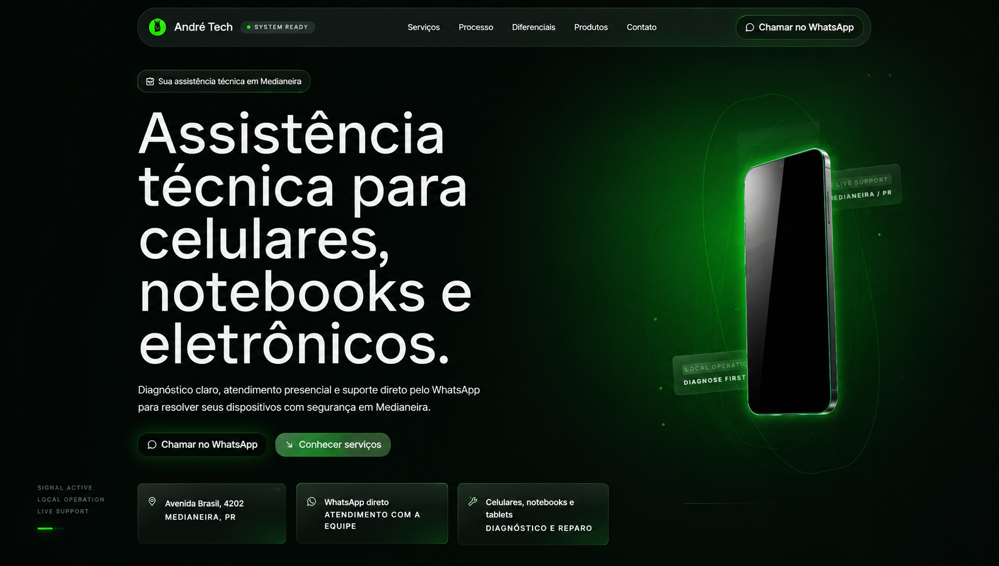

# André Tech — Cinematic Technical Assistance Experience

Experiência digital cinematográfica desenvolvida para a André Tech, uma assistência técnica localizada em Medianeira — PR.

O projeto combina:
- direção visual premium
- motion design atmosférico
- interface cinematográfica
- presença comercial local
- performance web moderna

Construído como uma landing page imersiva focada em:
diagnóstico,
confiança,
presença digital
e experiência visual diferenciada.

---



---

## Conceito

O projeto foi desenvolvido para fugir completamente do visual genérico de:
- assistências técnicas comuns
- templates WordPress
- landing pages SaaS genéricas

A direção visual utiliza:
- atmosfera escura cinematográfica
- glow verde técnico
- motion ambiental
- profundidade visual
- composição premium
- interface inspirada em laboratórios tecnológicos

---

## Stack

- React
- Vite
- TypeScript
- TailwindCSS
- Framer Motion
- GSAP
- Lenis Scroll
- Lucide Icons

---

## Features

- Hero cinematográfico premium
- Motion atmosférico
- Interface responsiva
- Scroll suave
- Performance otimizada
- Estrutura modular
- CTA integrado com WhatsApp
- Seções editoriais
- Layout mobile-first refinado
- Deploy otimizado para Vercel

---

## Estrutura

```txt
src/
 ├── components/
 ├── sections/
 ├── lib/
 ├── styles/
 └── assets/

public/
 ├── device.webp
 └── logo.svg
```

---

## Rodando localmente

Instale as dependências:

```bash
npm install
```

Inicie o ambiente de desenvolvimento:

```bash
npm run dev
```

Caso o PowerShell bloqueie execução:

```bash
npm.cmd run dev
```

---

## Hero Cinemático

O hero utiliza atualmente uma imagem premium estática localizada em:

```txt
public/device.webp
```

O sistema inclui:
- glow técnico
- profundidade atmosférica
- scan line
- motion sutil
- iluminação dinâmica
- composição cinematográfica

Sem necessidade de:
- vídeos
- sequência de frames
- canvas pesado
- FFmpeg

---

## Configuração

As principais constantes estão em:

```txt
src/lib/constants.ts
```

Controle de:
- WhatsApp
- links sociais
- serviços
- FAQ
- testimonials
- processo operacional
- CTAs

---

## Deploy

Projeto totalmente compatível com:

- Vercel
- Netlify
- Cloudflare Pages

Deploy recomendado:
Vercel.

---

## Filosofia Visual

A experiência foi construída com foco em:

- presença
- atmosfera
- direção cinematográfica
- identidade visual forte
- composição premium
- experiência sensorial
- linguagem visual autoral

O objetivo não era criar:
“mais uma landing page”.

E sim:
uma presença digital memorável.

---

## Status

Demo Version — Active Development

---

## Autor

Gustavo Henrique  
Creative Developer / Interface Systems

GitHub:
https://github.com/gguga1757-uxg